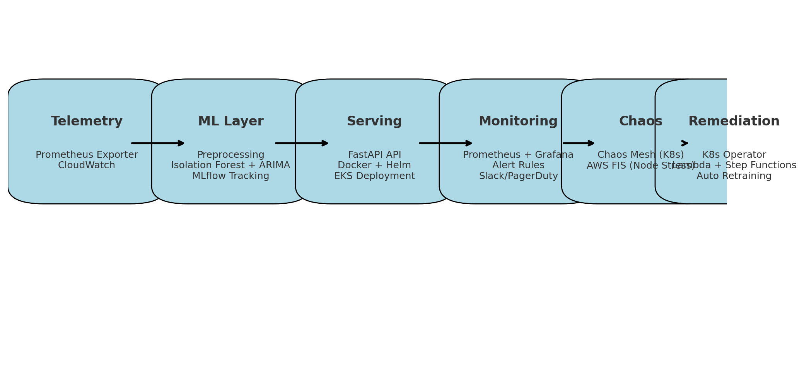

# ML Anomaly Detection Pipeline (End-to-End)


This repository implements a **production-ready MLOps pipeline** for anomaly detection and time-series forecasting of infrastructure metrics (CPU, memory, disk I/O, pod restarts, etc.) using **Prometheus, Kubernetes, Terraform, AWS, MLflow, and ArgoCD GitOps**.

---

## 📌 Features

- **Data Ingestion**
  - Prometheus metrics scraper
  - Synthetic metrics generator + Prometheus exporter for local testing
  - Metrics stored in S3

- **Preprocessing**
  - Sliding windows, z-score normalization
  - Seasonality adjustment for time-series

- **Model Training**
  - **Anomaly Detection**: Isolation Forest
  - **Forecasting**: ARIMA
  - **Hybrid Approach**: Forecast normal baseline + detect residual anomalies
  - MLflow used for experiment tracking

- **Model Serving**
  - FastAPI REST API
  - Packaged in Docker
  - Deployed on EKS with Helm
  - Horizontal Pod Autoscaling

- **Monitoring & Alerting**
  - Prometheus scrapes metrics
  - Grafana dashboards for visualization
  - Grafana alert rules (CPU > 85%) → Slack / PagerDuty

- **Auto-Remediation**
  - Kubernetes Operator to restart pods
  - AWS Lambda to restart EC2 instances
  - Step Functions retraining pipeline triggered on persistent anomalies

- **MLOps**
  - Champion/Challenger model evaluation
  - MLflow experiment tracking (metrics, params, artifacts)
  - Retraining orchestrated with AWS Step Functions
  - **Auto-Rollback** on failed Terraform apply → previous `mlflow_version` restored automatically

- **Infrastructure as Code**
  - Terraform provisions:
    - EKS cluster
    - RDS (Postgres backend for MLflow)
    - S3 (artifacts, metrics, models)
    - IAM roles
  - GitOps (ArgoCD App of Apps) manages all Helm deployments:
    - MLflow Tracking Server
    - Anomaly API
    - Prometheus + Grafana
    - Auto-Remediator

---

## 📂 Repository Structure

```
ml-anomaly-pipeline/
├── README.md
├── requirements.txt
├── Makefile
├── terraform/                 # Terraform IaC
│   ├── main.tf
│   ├── mlflow_rds.tf
│   ├── mlflow_s3.tf
│   ├── mlflow_helm.tf
├── ml/                        # ML training + inference
│   ├── generate_metrics.py
│   ├── prometheus_exporter.py
│   ├── preprocess.py
│   ├── train.py
│   ├── inference.py
├── api/                       # Serving API
│   ├── app.py
│   └── Dockerfile
├── monitoring/                # Monitoring + Alerting
│   ├── prometheus.yml
│   ├── grafana_dashboard.json
│   └── grafana_alerts.json
├── lambda/                    # AWS Lambda functions
│   ├── evaluate_model.py
│   └── trigger_stepfn.py
├── stepfunctions/             # Step Functions definitions
│   └── anomaly_retrain.asl.json
├── gitops/                    # ArgoCD GitOps
│   ├── root-app.yaml
│   ├── mlflow-app.yaml
│   ├── anomaly-api-app.yaml
│   ├── prometheus-app.yaml
│   ├── grafana-app.yaml
│   └── operator-app.yaml
├── docs/
│   ├── architecture.png
│   ├── demo.gif
│   ├── mlflow_pipeline_flowchart.png
│   ├── mlflow_pipeline_flowchart.md
│   └── mlflow_pipeline_flowchart.mmd
```

---

## 🚀 Quickstart

### 1. Generate synthetic dataset
```bash
python ml/generate_metrics.py
python ml/preprocess.py
python ml/train.py
```

### 2. Run Prometheus exporter locally
```bash
python ml/prometheus_exporter.py
# Metrics at http://localhost:8000/metrics
```

### 3. Train & serve model locally
```bash
uvicorn api.app:app --reload --port 8080
curl -X POST http://localhost:8080/predict -H "Content-Type: application/json" -d '{"cpu_zscore": 2.1, "memory_zscore": 1.5}'
```

### 4. Deploy Infra with Terraform
```bash
cd terraform
terraform init
terraform apply
```

### 5. Deploy Apps with ArgoCD
```bash
kubectl apply -f gitops/root-app.yaml -n argocd
```

---

## 🔄 CI/CD

- GitHub Actions workflow:
  - Mirrors MLflow images into ECR.
  - Posts **Terraform upgrade instructions** to Slack/Teams.
  - Auto-bumps `mlflow_version` in `terraform.tfvars` via PR when new versions are mirrored.
  - Runs Terraform plan on PR, apply on merge.
  - On **failure** → auto-rolls back to last good version and posts rollback notification.
- Drift correction ensures infra + MLflow always matches Git.

---

## 📊 Monitoring

- **Prometheus**: scrapes metrics every 5s  
- **Grafana Dashboard**: `monitoring/grafana_dashboard.json`  
- **Grafana Alerts**: `monitoring/grafana_alerts.json`  
- Example: CPU > 85% for 1 min → Slack alert

---

## ✅ End-to-End Flow

1. Prometheus collects metrics  
2. Grafana visualizes + alerts  
3. Alert triggers remediation (K8s Operator / Lambda)  
4. Step Functions retraining pipeline launches  
5. Champion vs Challenger evaluated → MLflow tracks experiments  
6. Best model deployed via FastAPI on EKS  

---

## 🖼️ Architecture Diagram



This diagram shows the full pipeline:
- **Telemetry** → Prometheus exporter, CloudWatch
- **ML Layer** → Preprocessing, Isolation Forest, ARIMA, MLflow
- **Serving** → FastAPI API on EKS (Helm + Docker)
- **Monitoring** → Prometheus, Grafana dashboards & alerts
- **Chaos Testing** → Chaos Mesh, AWS FIS, Locust
- **Auto-Remediation** → K8s Operator, AWS Lambda, Step Functions

---

## 🔄 CI/CD + Rollback Flow (Mermaid)

```mermaid
flowchart LR
    mirror[🔄 Mirror MLflow<br/>(DockerHub → ECR)]
    notify[📢 Notify Slack/Teams<br/>+ Terraform instructions]
    bump[🤖 Bump Workflow<br/>(Update terraform.tfvars,<br/>Open PR)]
    plan[📝 Terraform Plan<br/>(Comment on PR)]
    apply[🚀 Terraform Apply<br/>(on merge to main)]
    success((✅ Success<br/>Slack + Teams Notify))
    fail((❌ Failure<br/>Slack + Teams Alert))
    rollback[🔄 Auto-Rollback PR<br/>+ Auto-Merge]
    rollback_notify((📢 Rollback Success<br/>Slack + Teams Notify))

    mirror --> notify
    mirror --> bump
    bump --> plan
    plan --> apply
    apply -->|success| success
    apply -->|failure| fail
    fail --> rollback
    rollback --> rollback_notify
```

---

## 🎥 Demo (Chaos Test + Grafana Alert)


*This demo shows a chaos experiment (pod kill) triggering anomalies → Grafana alert firing → auto-remediation + rollback kicking in.*
